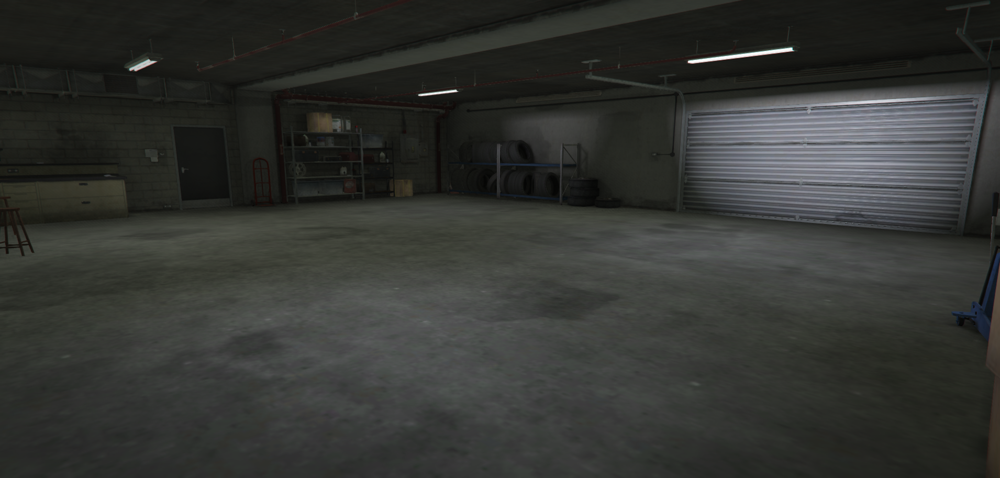
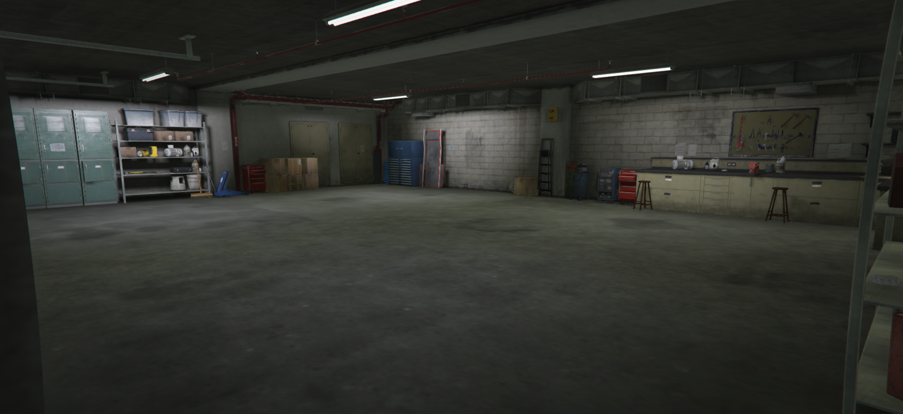
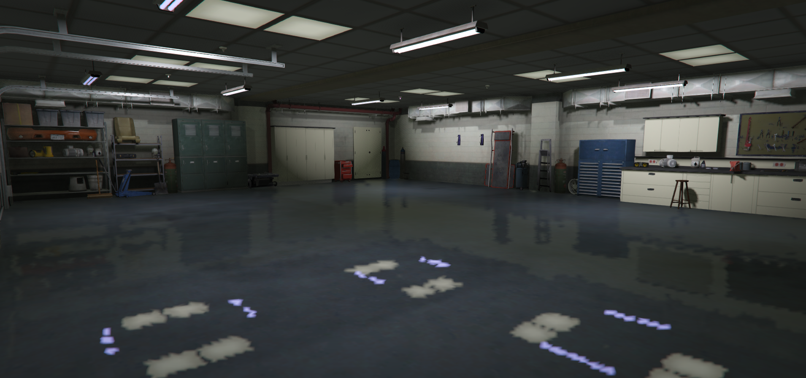
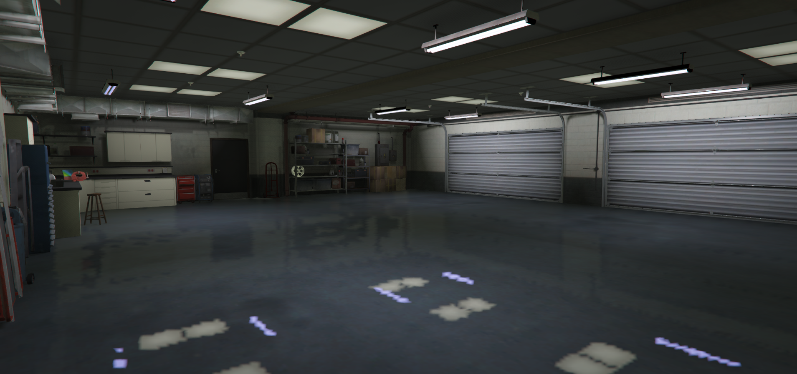
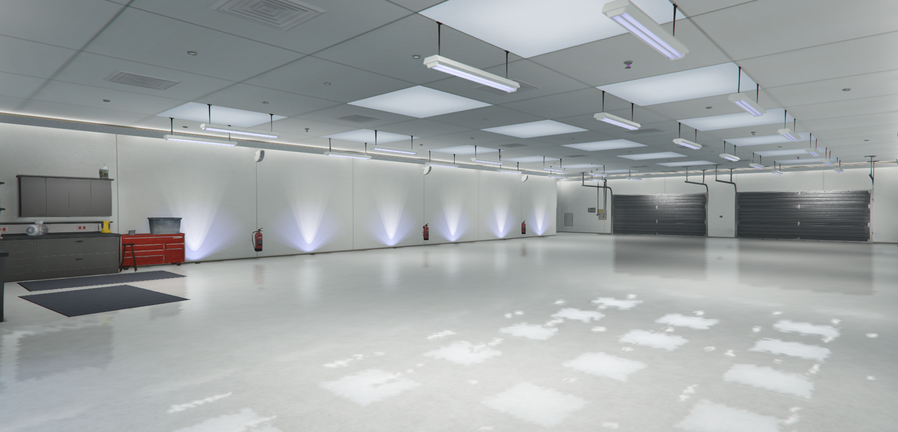

# Garage Voiture

## À Vendre : Garage Deux Places 

L'agence immobilière Dynasty 8 est ravie de vous présenter ce garage spacieux de deux places, idéal pour protéger vos véhicules et offrir un espace de rangement supplémentaire.

**Caractéristiques :**

* Deux places de stationnement côte à côte
* Espace bien éclairé et sécurisé
* Accès facile et pratique
* Situé dans un quartier calme et résidentiel

**Prix :** 10,000 $

Pour plus d'informations ou pour organiser une visite, veuillez contacter l'agence immobilière Dynasty 8. Ne manquez pas cette opportunité d'acquérir un espace de stationnement pratique et sécurisé !

<figure><figcaption></figcaption></figure> <figure><figcaption></figcaption></figure>

***

## **À Vendre : Garage 4 Places**

**Description :** Découvrez ce spacieux garage de 4 places, idéal pour garer vos véhicules en toute sécurité. Ce garage offre un accès facile et une grande commodité, avec un emplacement au choix du client.

**Caractéristiques :**

* 4 places de stationnement
* Espace bien éclairé
* Accès facile et sécurisé
* Idéal pour les voitures, motos
* Emplacement au choix du client

**Prix :** 25,000 $

**Contact :** Pour plus d'informations ou pour organiser une visite, veuillez contacter notre agence immobilière dans la section service, puis composez le "dynasty 8" sur le téléphone.

Ne manquez pas cette opportunité d'acquérir un espace sûr et pratique pour vos véhicules. Contactez-nous dès aujourd'hui !

<figure><figcaption></figcaption></figure> <figure><figcaption></figcaption></figure>

***

## **À Vendre : Garage 6 Places**

**Description :** Profitez de cet impressionnant garage de 6 places, parfait pour abriter vos véhicules en toute sécurité. Situé dans un emplacement pratique, ce garage offre un accès facile et une grande commodité.

**Caractéristiques :**

* 6 places de stationnement
* Espace bien éclairé
* Accès facile et sécurisé
* Idéal pour les voitures, motos et stockage
* Emplacement au choix du client

**Localisation :** L'emplacement est flexible et peut être choisi par le client, offrant ainsi une grande commodité.

**Prix :** 35,000 $

**Contact :** Pour plus d'informations ou pour organiser une visite, veuillez contacter notre agence immobilière dans la section service, puis composez le "dynasty 8" sur le téléphone.

Ne manquez pas cette opportunité d'acquérir un espace sûr et pratique pour vos véhicules. Contactez nous dès aujourd'hui !

<figure><figcaption></figcaption></figure> <figure><figcaption></figcaption></figure>

***

## **À Vendre : Garage 10 Places**

**Description :** Découvrez ce vaste garage de 10 places, parfait pour garer vos véhicules en toute sécurité. Situé dans un emplacement pratique, ce garage offre un accès facile et une grande commodité.

**Caractéristiques :**

* 10 places de stationnement
* Espace bien éclairé avec un éclairage moderne
* Accès facile et sécurisé
* Idéal pour les voitures, motos et stockage
* Emplacement au choix du client

**Localisation :** L'emplacement est flexible et peut être choisi par le client, offrant ainsi une grande commodité.

**Prix :** 55,000 $

**Contact :** Pour plus d'informations ou pour organiser une visite, veuillez contacter notre agence immobilière dans la section service, puis composez le "dynasty 8" sur le téléphone.

Ne manquez pas cette opportunité d'acquérir un espace sûr et pratique pour vos véhicules. Contactez-nous dès aujourd'hui !

<figure><figcaption></figcaption></figure> <figure><figcaption></figcaption></figure>

